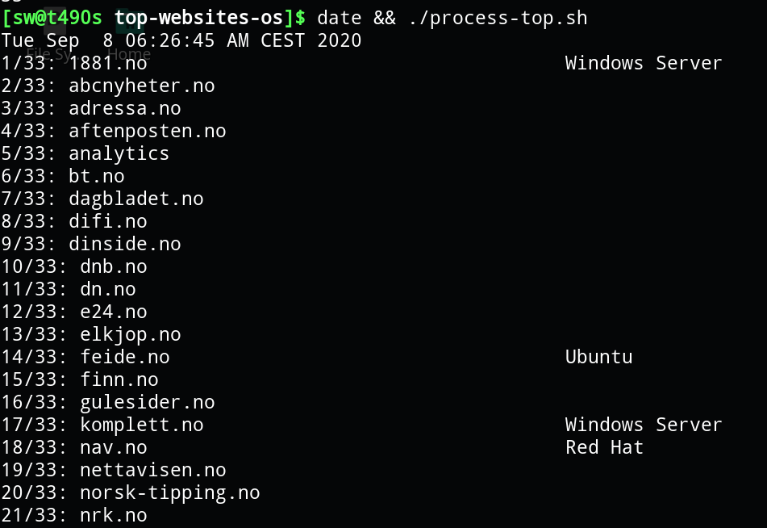

## Website or Domain Operating System Mass Scanner
Script that checks server's operating systems based on specified list of websites.

The solution utilizes Wappalyzer CLI docker container.

## Requirements
* Linux / Bash
* Docker
* jq, awk & pr installed

## Running
* Clone this repo: `git clone github.com/sxiii/domain-os-scan`
* Enter the folder: `cd domain-os-scan`
* Edit the file `scan-top.sh`, replacing the array "ntweb" with the websites that you want to scan
* Give permissions to run the scripts if needed: `chmod +x ./*sh`
* Run actual docker container wappalyzer scan `./scan-top.sh`
* Process results: `./process-top.sh`

## Bonus
Results are saved as JSON files into the ./json subfolder.

## NOTE
You might been asking, why make things so complicated, use docker container with wappalyzer, rather than just perform a xprobe2/nmap/ettercap/bettercap/angry ip scanner/other tool for this means? The answer is pretty easy.

In the modern days, if you're performing "network-level" scan or IP scan, you will stuck most of the time with the similar answers, like, OpenBSD, NetBSD, Linux with some older kernels, even sometimes AIX and other weird OS.

This is not wrong, actually, as the routers and load balancers and network infrastructure does indeed work with OpenBSD, NetBSD and some Linux devices most of the time. But you are getting answer for a different question! About network infrastructure. They are not about OS of the webserver! They are about OS of intermediary network infrastructure. 

When the aim of this project is to find out OS of the Web server. Nowadays webservers are often hidden behind (pun not intended) a lot of layers of physical and virtual networking infrastructure (load-balancers, cache servers, CDNs, etc.). To find this intermediary infrastructure OS versions or fingerprint it, of course, you can use nmap and all this stuff.

However, to find an actual webserver OS, in the modern era, we have to actually deal with HTTP traffic and sometimes even the website code itself - to try to find a host operating system, if told by the server. This is not always the case, and that's why some (or most) of the results are blank (which can be treated as "os unknown"). 

So Wappalyzer container does actual analyzing for us - it loads an "actual page" and tries to guess the webserver OS. Just what was requested.

Hope this explains the reasons behind this small scanner project.

## Questions, improvement etc.
If you have any question, improvement idea or PR, feel free to open an issue. All the questions and improvements are welcome.

## How the results look?

